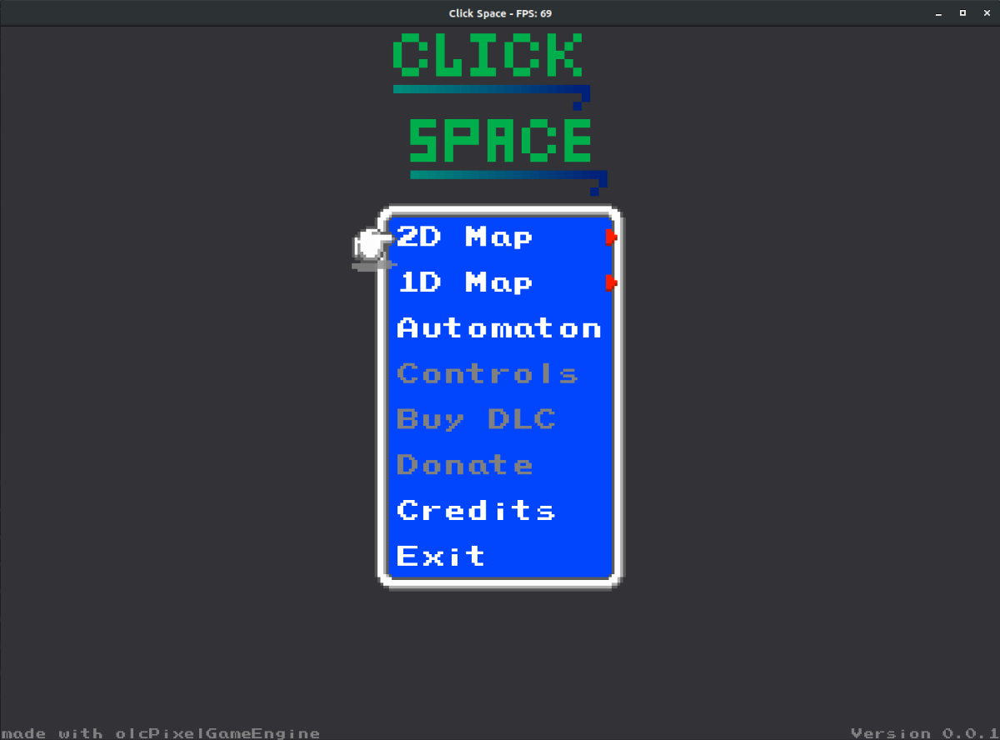
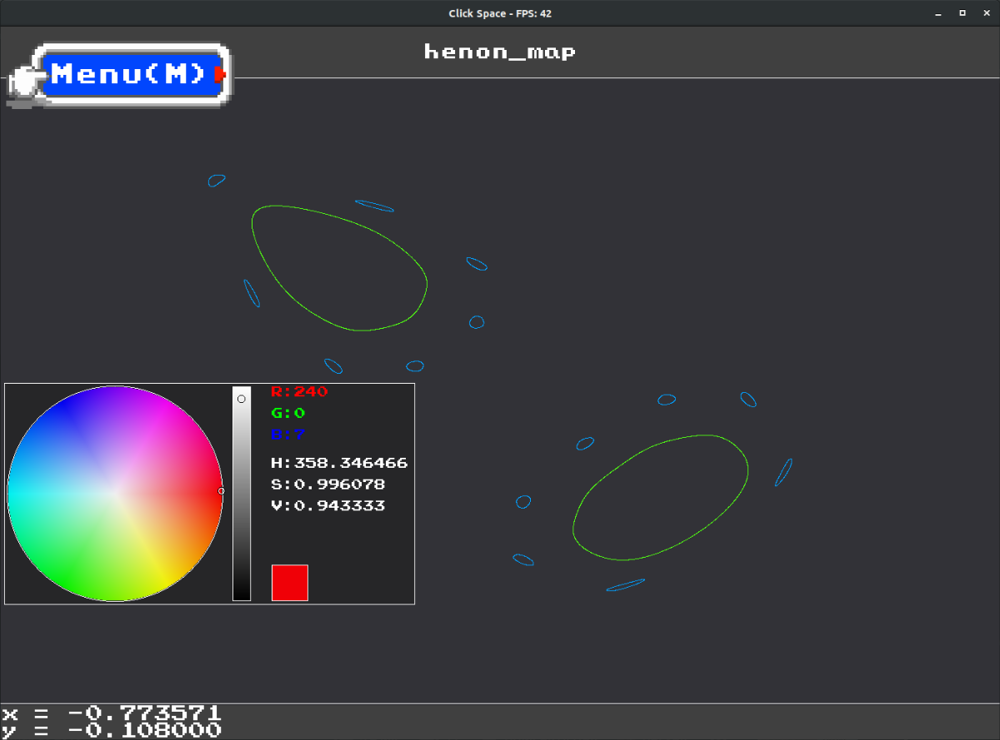
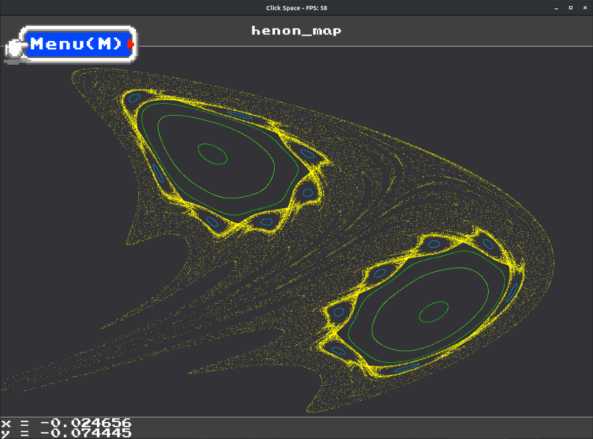
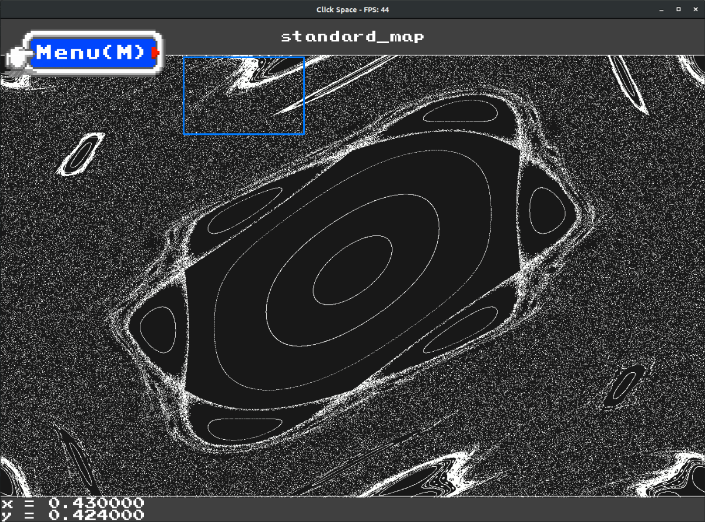
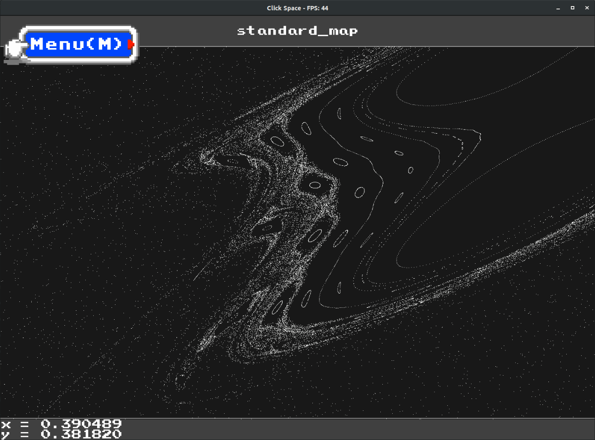
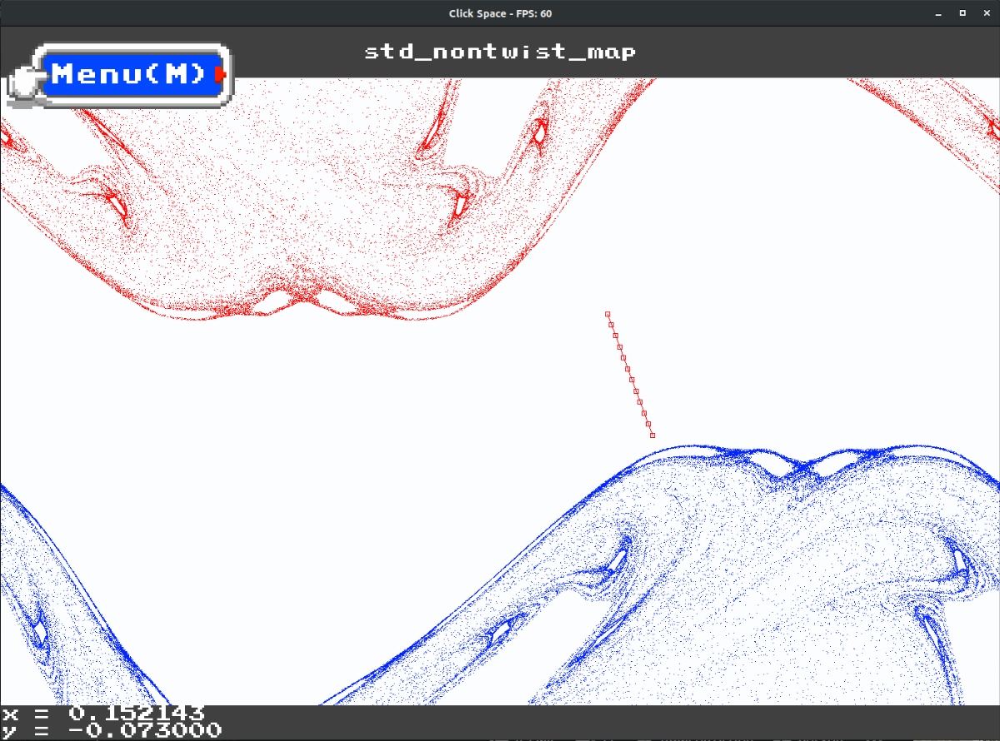
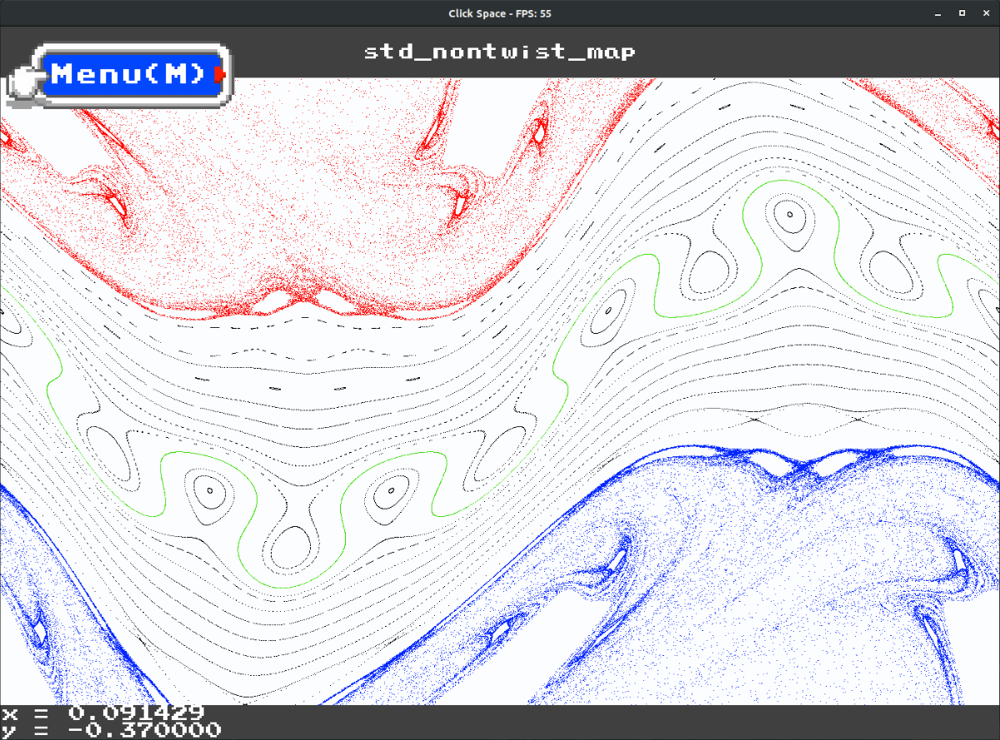
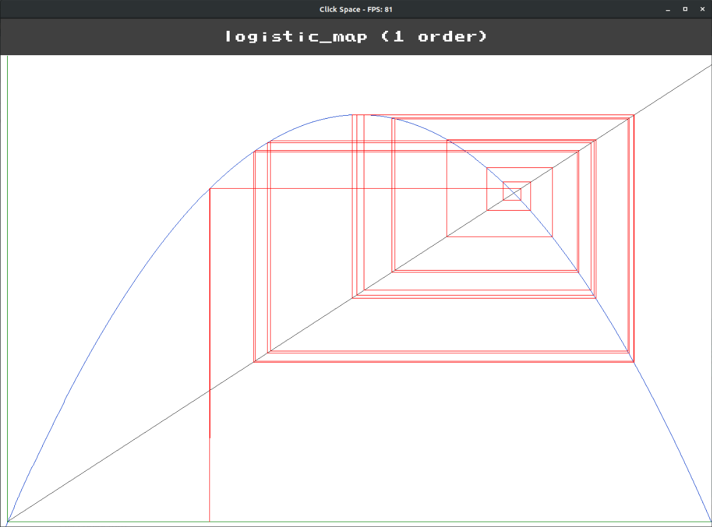
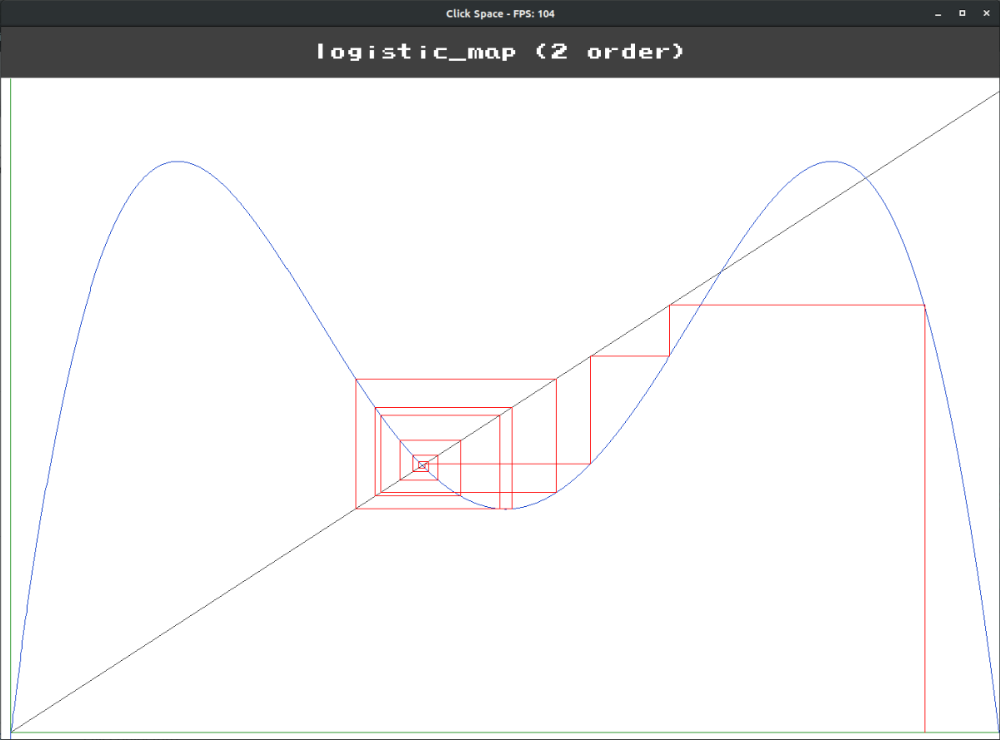
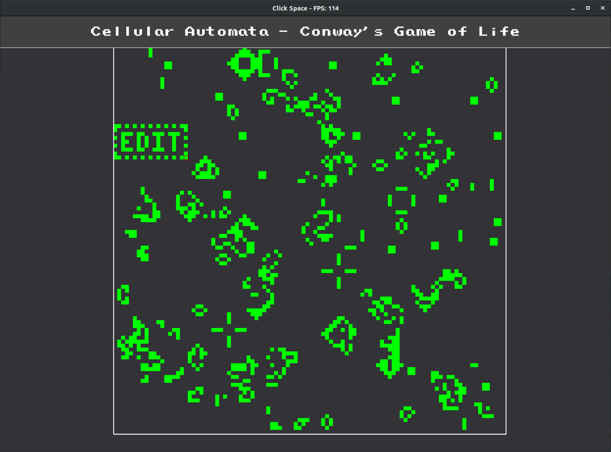

# Dynamical Systems
Development of a comprehensive and interactive tool for analyzing dynamical systems (2D and 1D maps) 
made by students of the Oscillations Control Group (http://portal.if.usp.br/controle/), Institute of 
Physics of the University of São Paulo, Brazil. 

Currently the program presents three main features, Cobe-Web interface for 1D maps, phase-space for 
2D map and a cellular automata model (Conway's Game of Life). Details and images on each one are shown 
below. Install and usage instructions can also be found down below. Enjoy and hack it as you wish.

Authors: M. Lazarotto; V. de Oliveira; M. Palmero (Last update 07/01/2021)
 
# Current features

## 2D maps

Interactive integration of orbits for 2D discrete maps, allowing for color selection (both canvas and 
points), set of line of initial conditions for multi-orbit calculation, zoom in|out, deletion of orbits 
and more.

### Library
* Halley
* Hénon
* Simplified Fermi-Ulam model
* Standard
* Standard nontwist

    
    

    
    

    
    

### Commands
Features from the 2D map can be used from a local menu (`M` open it, arrow key to navigate, `ENTER` to select 
and `Z` to return) or from key commands:

* `Left click` (hold): run orbit for clicked initial point
* `Right click`: open zoom window 
* (When zooming: `Left click` to set zoom)
* `C`: total zoom out
* `X`: delete last orbit
* `Ctrl + X`: delete all orbits
* `Ctrl + S`: Save all orbits (file in -> `results/map_name`)
* `Ctrl + Left Mouse` (hold and drag): Pan around the screen
* `Scrool UP`: Zoom in
* `Scrool DOWN`: Zoom out
* `R`: creates initial condition line
* `S`: destroy initial condition line
* `SPACE`: run dynamics for initial condition line points
* `Scrool UP|DOWN`: increases|decreases the number of points in initial condition line
* `N`: toggle night | light mode on and off.
* `D`: Debug info

## 1D maps

1D map interactive Cob-Web iteration, allowing change of the system main parameter and iteration order

### Library
* Linear sine 
* Logistic
* Logistic (2nd order)
* Moran
* Triangle

### Commands
* `Left click` (hold): run cob web iteration
* `w`: increase map parameter (par[0])
* `s`: decrease map parameter (par[0])
* `1-9`: Iteration order `(f(f(...f(x))))`

    
    

## Cellular Automata (Conway's Game of Life)

A cellular automata model widely know as Game of Life from John Conway. The starts from a random configuration, 
allowing one to stop, edit, evolve it by single steps

### Commands
* `Space`: pause|start iterations
* (When paused) `Left click`: Give life to a cell
* (When paused) `Right click`: Kill a cell
* `G`: Toggle grid on|off

    

## Install and Run
The makefile attached provides all flags for compilation, considering Linux OS, requiring only a `make` command 
from the terminal. Although olcPGE is multiplatform, this code was primarily made for Linux OS, without any testing 
in Windows, however, it shall be trivially ported.

In order to run on Linux, the application must be executed as `vblank_mode=0 ./dynamical_systems`, avoiding FPS 
locking. The olcPGE compilation requires basic obtainable libraries, which can be retrieved in Ubuntu from the 
repository with:

`sudo apt install build-essential libglu1-mesa-dev libpng-dev`

More information for other distros can be found at: https://github.com/OneLoneCoder/olcPixelGameEngine/wiki/Compiling-on-Linux

# Credits
This application is fully developed in C/C++ and based on the olcPixelGameEngine graphical library, as provided 
by Javidx9, the One Lone Coder (for whom the authors are deeply grateful) https://github.com/OneLoneCoder/olcPixelGameEngine. 
The original README and LICENSE files can be found at `licenses/`, and further details in the engine header file.
Particularly, the retro menu system was retrieved from Javidx9 educational material tutorials:
https://github.com/OneLoneCoder/olcPixelGameEngine/blob/master/Videos/OneLoneCoder_PGE_RetroMenu.cpp

## Future developments
* +Maps (with custom creation)
* +Analysis tools
* Bifurcation diagrams
* Billiards
* Fractals
